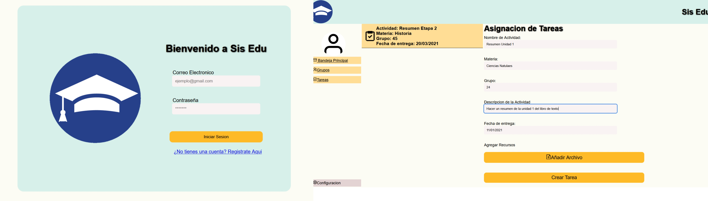

# SisEdu

SisEdu is a website designed for primary school teachers so that they can organize their groups and the different tasks assigned to them during the course, all of this using react and pure javascript.
